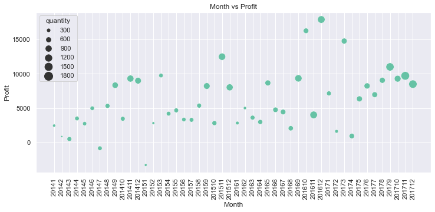

# DATA VISUALIZATION PROJECT 

## Description
* This projet was created to generate a simple code infraestructure to effectively visualize and analyze data stored in an excel or csv file. 

* Here we use simple SQL and python scripts to easily filter and visualize data, also we use PostgreSQL database to administrate our data. 

## Data collection 

* Data was collected from the 'resources section' of the course: 'Curso de Principios de Visualización de Datos para Bussiness Intelligence', from Platzi platform. 

## Data description

* Here, we use the dataset called 'superstore' which contains information about the sells and operations of a store. 

* The following pic shows some info of the database
 

## Results 

* The products of this project are 5 plots which solves 5 different *questions*

    * **Question 1**How much money the superstore made each year?
     

    * **Question 2** Who are the top 10 customer which spent the most money in the superstore?
    

    * **Question 3** How is the geographical distribution of profits across US states?
    

    * **Question 4** What is the percentage of profits each region has?
    

    * **Question 5** How much money the superstore made each month since there is available data?
    

## Database configuration 

* We first generate from excel, the csv file of the complete database, which name is 'superstore.csv' (This file is located in the 'data' folder)

* Once we have the csv file, we need to import it into postgreSQL, so the first step is to create in postgreSQL an empty table with the same structure as the 'superstore.csv' file. 
**NOTE:** the code for create the table structure is located in file 'codigo_sql.sql' inside 'data' folder. 

* After create the empty table in postgreSQL, we need to import the superstore database, to do so, we use the COPY command, which is easily explained [here](https://blog.devart.com/how-to-import-and-export-csv-files-into-a-postgresql-database.html#:~:text=Importing%20a%20CSV%20file%20using%20a%20COPY%20statement&text=Here's%20the%20basic%20syntax%20of,you're%20importing%20data%20from.), but basically the COPY structure is this: 

    COPY table_name  FROM 'location + file_name' DELIMITER ',' CSV HEADER;
* table name – the name of the table you want to import data into.
* ‘location + file_name’ – the full path to the file you’re importing data from.
* DELIMITER ‘,’ – specifies the delimiter we use as the comma symbol.
* CSV – specifies the format of a file we’re importing data from.
* HEADER – specifies that the target file contains a header row that should be skipped during the import process.

**NOTE:** the code for COPY command is located in file 'codigo_sql.sql' inside 'data' folder. (line 29)

## Exporting information 

Now that we have the database in postgreSQL, we need to start making queries and exporting these resoults into csv files to then visualize the data using Python. 

* To export the results of a query, we use the command COPY again, the only difference is that we need to change the keyword FROM to the TO keyword and write inside parenthesis after COPY the query we want to export. 
**NOTE:** the code for this is located in file 'codigo_sql.sql' inside 'data' folder, (line 35). This code has a simple query: *(SELECT * FROM superstore)* as example.

* Following the previous procedure, we used the five queries located in 'codigo_sql.sql' to export the five different datasets used to plot the figures:
    
    * FIRST QUESTION OR FIRST QUERY generated the file dataset: '
    

